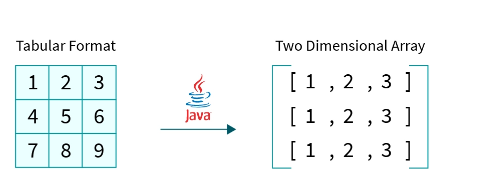
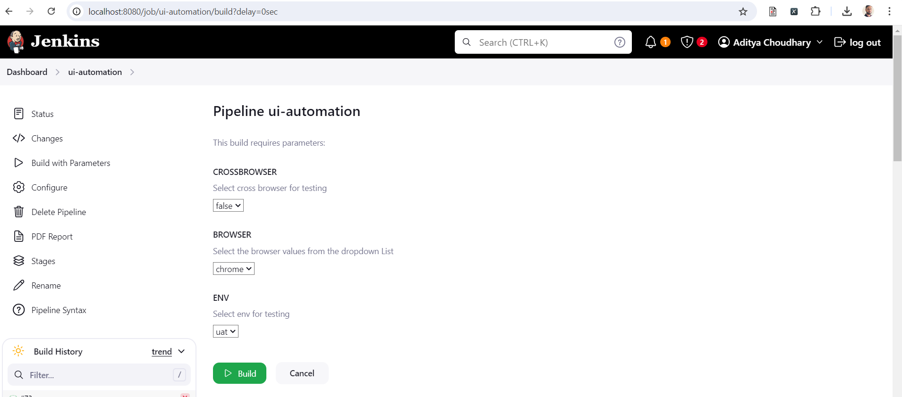
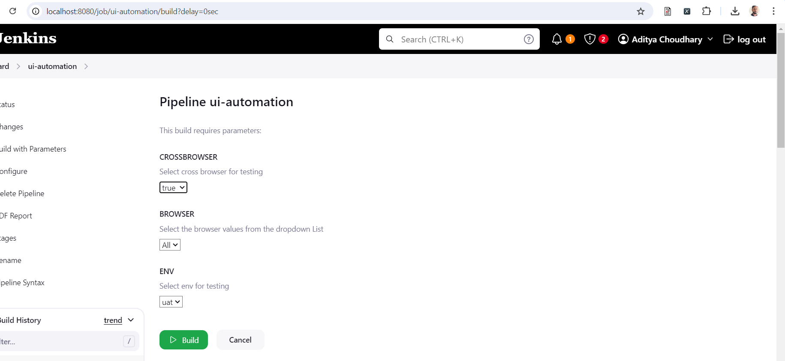
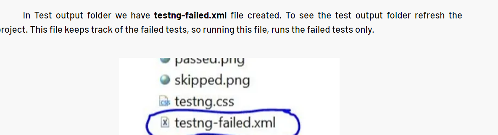

## Test Automation with Java and Selenium
This web test automation framework is built using Selenium with Java and Cucumber. I have used BDD framework to write our feature file using Jherkin language.
I have used page object model for reusability and easy maintenance. I have used Maven for build and maintain all project dependencies and plugins.

1. IntelliJ IDEA Community 
2. Programming Language -> Java 
3. Build Tool -> Maven
4. Web Test Automation Tool - Selenium 
5. Test Framework -> Cucumber and TestNG
6. Design Pattern -> Page Object Model (POM)
7. WebDriverManager is used for managing the drivers.

### Test Execution - Command line
mvn test -DsuiteXmlFile=testng.xml

mvn test -DsuiteXmlFile=testng.xml -Dbrowser=firefox -Denv=uat

mvn test -DsuiteXmlFile=testng.xml -Dbrowser=chrome -Denv=uat

For cross browser-
mvn test -DsuiteXmlFile=crossbrowser-testng.xml

### Parallel Execution in Cucumber - 
Parallel testing in Cucumber is the ability to execute Cucumber scenarios in parallel, allowing multiple scenarios to run simultaneously and speeding up the overall test execution time.

#### 1. Create ThreadLocal variable in DriverManager class - 
We use ThreadLocal class to create a ThreadLocal variable of type WebDriver.Each thread running a Cucumber scenario or step can have its own WebDriver instance, isolated from other threads.
This approach ensures thread safety and prevents conflicts when executing scenarios in parallel.

private static ThreadLocal<WebDriver> tldriver = new ThreadLocal<>();

#### 2. Create TestRunner File
This runner class extends AbstractTestNGCucumberTests which has scenarios methods defined. We override the scenarios method to run it in parallel mode.

```java
    @Override
    @DataProvider(parallel = true)
    public Object[][] scenarios() {
        return super.scenarios();
    }
```  

### Cross Browser Testing in Cucumber -

#### 1. Create a testng.xml file
testng.xml file allows to configure test suites and parameters for text execution. Suppose we want to run test on multiple browser using the same code base.
We need to create a suite tag and within it we need to mention the test. We can have chrome test firefox test and safari test.

Parameterization in Selenium refers to the process of dynamically passing parameters or input data to test methods or test scripts. This allows to execute the same test logic with different data sets, thereby enhancing test coverage, reducing redundancy, and improving maintainability.

We can achieve parameterization in TestNG by 2 ways-

1. Using Parameters annotation and TestNG XML file.
   <parameter name="env" value="uat" />
2. Using DataProvider annotation.

### Data Provider 

Data provider is an annotation in testng to pass multiple set of test data to the methods.

@DataProvider(parallel = true)

```java
public class Test {
 @DataProvider (name = "DataContainer")
 public Object[][] myDataProvider(){
     Object data[][] = new Object[2][3];
     data[0][0] = 2;
     data[0][1] = 3;
     data[0][2] = 5;
     
     data[1][0] = 5;
     data[1][1] = 7;
     data[1][2] = 9;
     return data;
  // Object data[][] = {{2, 3 , 5}, {5, 7, 9}};   
  // return data; 
  //  We basically create a 2-dimensional matrix array containing rows and columns.
 }

 @Test (dataProvider = "DataContainer")
 public void calculate (int a, int b, int result) {
  int sum = a + b;
  Assert.assertEquals(result, sum);
 }
}
```

A data provider method has a return type as 2D array because we get test data in forms of rows and columns so that we need 2D object.

A two-dimensional array (or 2D array in Java) is a linear data structure that is used to store data in tabular format.



Hence, in Java, a two-dimensional array is a collection of pointers, where each pointer refers to a one-dimensional array that represents a particular row of the 2D array.

//Declaring 2D array
int[][] a;

//Creating a 2D array
a = new int[3][3];

```java
int[][] oddNumbers = { {1, 3, 5, 7}, {9, 11, 13, 15}, {17, 19, 21, 23} };

for(int i = 0; i < oddNumbers.length; i++){
  for(int j = 0; j < oddNumbers[i].length; j++){
   System.out.println(oddNumbers[i][j]);
 }   
}
```

### Jenkins Integration-
I have created Jenkinsfile using declarative pipeline syntax, where we have to option to select browser and env where we want to run our test.
We can also select CROSSBROWSER as true to run test on multiple browsers, by default it will run with cross browser as false.



### Features of the framework--

#### Parallel Testing and Cross Browser Testing-
 testng.xml is a configuration file for organizing and executing test.We can provide different test suites and specify test classes to execute for parallel testing
 This significantly reduces execution time, improving overall efficiency and productivity in testing.
 testng.xml allows to run same test with different input data. Ex we can pass different browser and env values as parameters.

#### Organizing and grouping the test-
We can organize test into different logical groups.Like can create different suites for running test on different browser.
<test thread-count="3" name="TestChrome">
<test thread-count="3" name="TestFireFox">

#### Integration with Jenkins-
testng.xml integrates easily with build tools like Maven and Jenkins. 
We use maven sure fire plugin which executes testng.xml which ultimately executes runner file mentioned insides class in testng.xml.

#### Page Object Model-
inside src/main.java we have created page classes for every page. We have defined variables for web elements using page factory or direct element instantiation. For using the methods of these classes we need to created objects and call those methods.
Page class will have locator to identify the elements, page specific methods and a constructor to initialize the page class variables.

In Page object model, a class is created for every webpage where all elements and relevant methods of respective webpage is stored.This way it helps in separating the page objects from the test and helps in easy maintenance of tests.

#### OOPS based-
1. Framework supports Inheritance -> We have created a BasePage abstract class which defines the common methods for all the pages of the application like
 getPageTitle, selectDropdownValue, waitUntilElementVisible etc. These methods are then reused in all the page classes. This way we are achieving inheritance. This promotes reusability.
For Ex -If we don't write these common methods at parent class, then we would have to write select statement and exception handling multiple times.

2. Framework supports encapsulation -> Binding the fields and methods together. For ex we have DriverManger class where we have private threadlocal variable and public getters and setters. Also in POJO class we have private variables and public getters and setters.

3. Framework supports Polymorphism -> Polymorphism allows us to perform same task in different ways. Click, selectDropDown are the methods in the framework that show method overloading. SelectDropDown method can select a dropdown by text or by index.

4. Framework supports Abstraction -> We have base page abstract class, which contains abstract and non-abstract methods.

#### Benefits-
1) Easy Code Maintenance- Changes to UI elements are localized within page classes, reducing test case maintenance efforts.
2) Reusability- Page class objects are reused across multiple test cases , therefore reducing code duplication
3) Better Readability- Test are more focussed on business logic, making them easier to understand and review.


### Why Page object ?
In our framework for every class we have a private instance driver variable. If we make its value static then its value will point to specific driver object and if there is a scenario of running login test on multiple browsers will not be possible.
Right now we can create a page object by passing dynamic driver objects and test run will on multiple browsers.


### Usage of map, list in the automation framework ?


### Usage of static, final in the framework ?
Static is a keyword used with blocks, variables and methods.Static belongs to class instead of the object. Static is mainly used for memory management.
In this automation framework, we have PropertyUtils class which has static members and static methods, because the value of static members like url, username, password will be same for entire execution of the program. Also, this is a final class because we don't require to extend this class.

PropertyUtils class - static members and methods and a final class.

Final is a keyword used for variables, methods and class.When a class in final, it cannot be inherited. Method cannot be overridden and variable cannot be modified.
final variables -> We have FrameworkConstants class which has final variables like resource path, config file path and all.

FrameworkConstants - static final variables.

### ThreadLocal class in java-
ThreadLocal is a class in Java that allows you to create variables that can only be read and written by the same thread.
This can be useful in situations where you have multiple threads accessing the same variable, but you want to ensure that each thread has its own isolated copy of the variable.

Case study-  If you write 2 test and each opening a new URL and printing a title. If you run them parallely without using thread local variable.
Both the threads will point to same WebDriver reference variable and getTitle for both test may result same result as both threads are pointing to same reference variable.


### Retry failed test cases 
To utilize the rerun plugin, configure the Cucumber runner with the appropriate plugin option

plugin = {"rerun:target/failedrerun.txt

In this example, we’ve configured the plugin option with "rerun:target/failedrerun.txt". This tells Cucumber to write information about failed scenarios to the failedrerun.txt file in the target directory.

#### Rerunning Failed Scenarios
To rerun the failed scenarios, create another test runner specifically for reruns:

features = "@target/failedrerun.txt",

In this runner, we’ve specified features = "@target/failedrerun.txt", which instructs Cucumber to run the scenarios listed in the failedrerun.txt file. Cucumber will now rerun only the failed scenarios from the previous test run.


### How to Execute Failed Test Cases in TestNG?
There are two ways to perform a failed test in TestNG:

1. Using the testng-failed.xml file.


Run this testng-failed.xml file: Right click=> Run As => TestNG Suite. The console output is as below:

2. Using the IRetryAnalyzer interface.

we implement IRetryAnalyzer interface provided by TestNG. By overriding retry() method of the interface in your class, you can control the number of attempts to rerun a failed test case.
```java
public class RetryAnalyzer implements IRetryAnalyzer {
    int retryAttemptsCounter = 0;
    //Set the value to the number of times we want to retry
    int maxRetryLimit = 3;
    //Method to attempt retries for failure tests
    public boolean retry(ITestResult result) {
        if (!result.isSuccess()) {
            if(retryAttemptsCounter < maxRetryLimit){
                retryAttemptsCounter++;
                return true;
            }
        }
        return false;
    }
}

@Test(retryAnalyzer = RetryAnalyzer.class)
public void failedtest() {

    System.out.println("Failed test run");
    Assert.assertTrue(false);
}
```

### Soft Assertions and Hard Assertions.
There is a scenario whenever “Assert.assertEquals()” function fails automatically it has to take screenshot. How can you achieve this?
We can override onAssert Failure method and decide what should happen.

```java
public class CustomSoftAssert extends SoftAssert {

    @Override
    public void onAssertFailure() {
        new BasePage().takeScreenshot();
    }
}

public static CustomSoftAssert softAssert = new CustomSoftAssert();
softAssert.assertEquals();
softAssert.assertAll();  -> It makes sure test fails if any of the assertions fails.
```

### Listeners in Java

### What will you do if there are failures in your suite execution and what is your approach?
While executing the automation scripts, test cases may fail for several reasons. To optimize our next runs, we need to re-run only failed test cases. How to execute failed Test cases? What is the best approach? In TestNg class, we can easily re-run the test cases using two methods as explained below:

Method 1:  By using testng-failed.xml file in test-output folder and run it directly.

Method 2:  By implementing TestNG IRetryAnalyzer for pure testNG framework, you can set retry count and all here.

Method 3. In cucumber framework, use plugin rerun

### Setup Project 
Easy way-
1) Create an empty repository on GitHub
2) Use git clone to clone the repository on local
3) Create a maven project locally and copy its content to this newly cloned empty repository.
4) Navigate to cloned repository
5) That's it, and you can use git commands pull and push

Proper way
1) Open GitHub and create a new repository with same name as local repo that we are going to create in below steps.
2) Open eclipse and create a new Maven project
3) open git bash and type below commands
4) git init to initialize or convert existing project to git repo
5) git add . to add all files to staging area
6) git commit -m "message"
7) git remote add origin https://github.com/aditya2001/selenium-java-cucumber
8) git push -u -f origin master
The -f switch forces Git to overwrite any files that already exist on GitHub with your existing project’s files.


